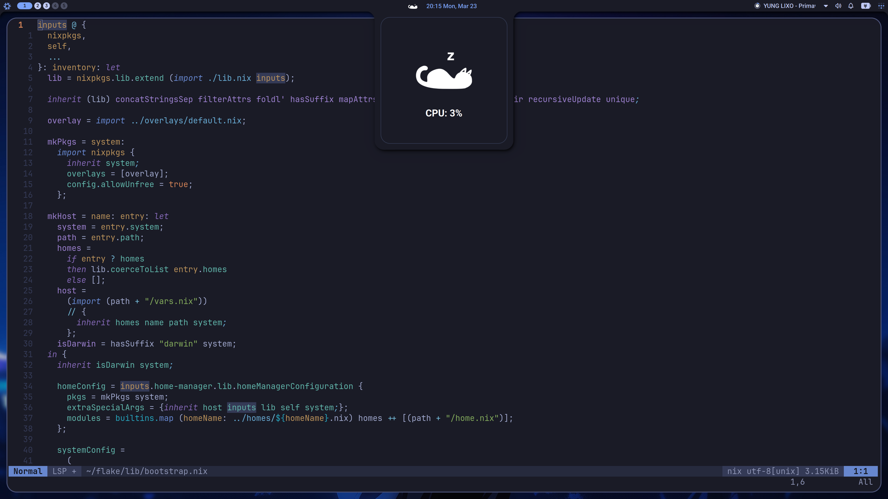
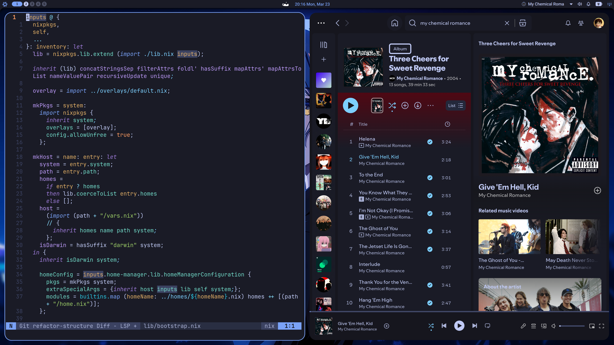

# N4

My personal flake, focused on modularity with central pieces around N4:
- **Nixos** as my favorite Operating System
- **Niri** as a window manager
- **Noctalia** as the desktop shell
- **Neovim** as my favorite Editor

#### Features
- reusable homes
- theme-driven

## Screenshots
N4 has support for multiple themes, here are some of them:

##### Tokyo night
- 
- 
- 

## Structure

- `flake.nix` - inputs and host inventory
- `lib/` - bootstrap logic and flake helpers
- `hosts/` - per-machine `configuration.nix`, `home.nix`, and `vars.nix`
- `homes/` - reusable home-manager bundles like `default` or `minimal`
- `modules/` - reusable nixos and home-manager modules
- `themes/` - one file per theme, shared by system and home
- `overlays/` - package overrides
- `nvim/` - my neovim config
- `assets/` - wallpapers, profile pictures, fetch art, and later screenshots

Current hosts:
- `ryo` - main nixos laptop

Wip hosts:
- `server` - smaller server-ish setup
- `desktop` - desktop gaming setup
- `laptop` - minimal setup for low power laptop

## Themes

Themes live in `themes/*.nix`.

Each host picks one in its `vars.nix`:

```nix
{
  theme = "tokyo-night";
}
```

Theming works in a combination with stylix, wallpaper and custom colors passed through the config.

### Special thanks
I inspired myself in lots of configs like
- [anotherhadi/nixy](https://github.com/anotherhadi/nixy)
- [zoriya/flake](https://github.com/zoriya/flake)

#### Todo

##### Nix
- [ ] Fix tmux-sesh script
- [ ] nix utilitys script (nixy like)
- [ ] divide packages on nixos system better
- [ ] have a affinity module
- [ ] create separate modules for brave and zen
- [ ] Fix affinity linux

##### Niri
- [ ] Add transparency to other windows

##### Neovim
- [ ] Add supermaven?
- [ ] Config opencode.nvim
- [ ] Add yazi.nvim
- [ ] Add harpoon again
- [ ] Add svelte support
- [ ] snacks nvim welcome extension?
- [ ] unclash nvim
- [x] Fix the annoying copy command thing
