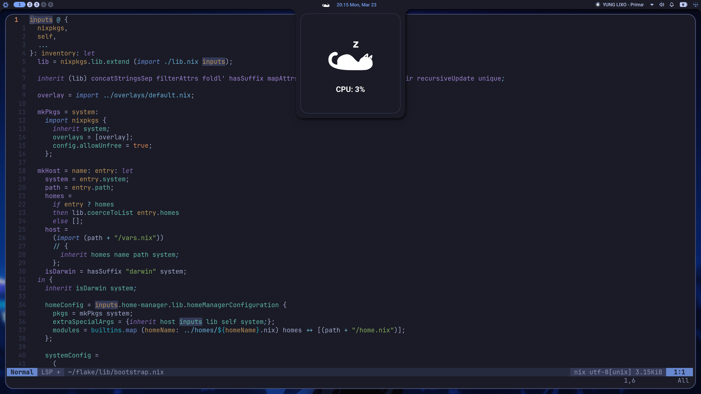
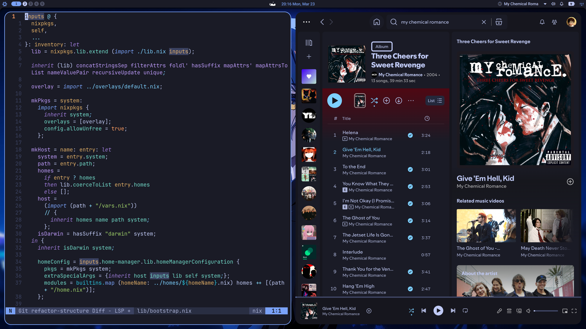

# N4

My personal multi-system Nix flake, centered around:

- **NixOS** as the operating system
- **Niri** as the window manager
- **Noctalia** as the desktop shell
- **Neovim** as the editor

## Hosts

- `ryo` — main NixOS laptop
- `server` — home server

## Structure

```text
flake.nix        host inventory and inputs
lib/             flake bootstrap and helpers
hosts/           hardware and machine-specific configuration
modules/nixos/   reusable NixOS modules grouped by domain
modules/home/    reusable Home Manager modules grouped by domain
nvim/            Neovim package and configuration
overlays/         package overrides
themes/           shared system and Home Manager themes
assets/           wallpapers, profile pictures, fetch art, and screenshots
```

Configuration flows directly from each host to the modules it needs:

```text
flake.nix → hosts/<name> → modules
```

Host-specific services stay with their host. Shared behavior belongs in
`modules/nixos/` or `modules/home/`.

## Commands

Build or activate a NixOS host:

```bash
sudo nixos-rebuild switch --flake .#ryo
sudo nixos-rebuild switch --flake .#server
```

Build or activate only Home Manager:

```bash
home-manager switch --flake .#ryo
home-manager switch --flake .#server
```

Format the repository:

```bash
nix fmt
```

## Themes

Themes live in `themes/*.nix`. Each host selects one in its `vars.nix`:

```nix
{
  theme = "tokyo-night";
}
```

The selected theme provides Stylix settings, colors, wallpaper, and profile
picture information to both NixOS and Home Manager.

## Screenshots

### Tokyo Night

- 
- 
- 

## Inspiration

- [anotherhadi/nixy](https://github.com/anotherhadi/nixy)
- [zoriya/flake](https://github.com/zoriya/flake)
- [gruberdev/nix](https://github.com/gruberdev/nix)
